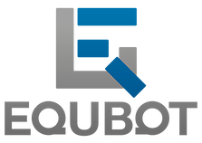

# 

FinTech Case Study: Man versus Machine in Stock Picking   

## Table of Contents
1. [Company Information](#Company-Information)
1. [Business Activities](#Business-Activities)
1. [Landscape](#Landscape) 
1. [Results](#Results)
1. [Recommendations](#Recommendations) 
1. [Addendum](#Addendum)

---

# Company Information 

* [**EquBot**](https://equbot.com/), a financial  technology company, is the first to introduce an ETF that uses proprietary Artificial Intelligence on the IBM Watson platform to pick stocks. It processes over one million pieces of information daily to analyze 15,000 companies globally to generate stock ideas and construct an optimal portfolio. The company compares this to the work of 3,000 research analysts. 
* Founders: Chida Khatua, CEO, Art Amador, COO, and Chris Natividad, CIO
* Headquartered in  San Francisco  

### Timeline
1. Founded in January 2017
2. Received $335,000 in angel funding in 2017 from one investor  
3. Launched the first ever actively managed AI-Powered US Equity ETF, [AIEQ](https://etfmg.com/funds/aieq/), on NYSE Arca in October of 2017 with $2.5 million in assets 
4. AIEQ was one of the most popular ETF launches in 2017
4. Launched an AI-Powered International Equity ETF, [AIIQ](https://aiiqetf.com/), in June of 2018 

The idea to create EquBot occurred after a discussion between co-founders Art Amador and Chida Khatua while students at Berkeley-Haas. In that discussion, Art had previously worked in Private Wealth Management at Fidelity Investments and was expressing his frustration with the amount of information his high net worth clients had expected analysts to process and understand about the markets. Chida, who holds two master's degrees in engineering, had previously worked in machine learning and artificial intelligence at Intel for 17 years. He saw an opportunity to utilize the same technologies to analyze markets and companies that could go beyond what a team of research analysts could cover. They both agreed as market data increases so will the level of decision making when it comes to investing. Chida and Art started experimenting with IBM Watson in the summer of 2016 and the company was formed in January 2017. 

Equbot has since launched AIEQ and AIIQ which are exchange-traded funds (ETF). An exchange-traded fund (ETF) is a basket of securities, trades on a stock exchange, and can be bought or sold similar to individual stock.  There are roughly 2,000 US ETFs offered on most asset classes from traditional investments to alternative assets like commodities or currencies. Equbot is the first to offer AI-powered active equity ETFs.  

# Business Activities

The investment management industry is primarily divided between actively managed funds and passively managed funds. An actively managed investment fund is a fund in which a manager or an investment team makes decisions about how to invest the fund's money. A passively managed fund tracks a market index and does not have an investment team making investment decisions. Equbot has entered the actively managed investment industry taking a different approach from traditional stock selection and portfolio construction. Equbot's ETFs do not have a portfolio manager or investment team, they run autonomously to remove human bias and errors that they believe negatively impacts performance in traditional strategies. The stocks are selected, and the portfolios are constructed based on rankings generated from the AI-machine. Equbot sees the use of these modern technologies in a data explosive environment as a competitive edge in the market and seek to produce consistent above-average returns in all market environments.

Within the hedge fund industry, there has been an uptake in incorporating new technologies and AI in the investment process. Based on market research firm Preqin, out of 14,000 active hedge funds approximately 1,300 are using computer models to make trades and 150 are incorporating AI. The number of AI hedge funds launched in 2017 was up +77% but assets under management in aggregate is still relatively small at approximately $17bn. Examples of new AI funds recently launched include Cerebellum Capital, Taaffeite Capital Management, and Numerai. Equbot decided against launching as a hedge fund. Hedge funds are primarily only available to high net worth investors and Equbot's mission "is to provide everyone with access to investment opportunities that artificial intelligence can uncover." Therefore, Equbot structured the portfolios as ETFs.  

Equobot's technology is a combination of proprietary algorithms, multiple artificial intelligence (AI) cognitive computing platforms, and IBM Watson. It is a multi-staged process that seeks to identify mispriced investments in the marketplace, optimize exposure, and then capitalize on the timing of those positions. It combines both fundamental and quantitative analysis.  It is designed to recognize patterns by analyzing data from earnings releases, financial statements, news, and social media trends, capturing the companies with the most opportunity to appreciate in the next 6-12 months. It builds predictive financial models on over 15,000 globally traded companies. It then parses through over one million news articles and social media postings daily to incorporate market sentiment. It also evaluates company regulatory filings and assesses company management metrics to track if a company's stated strategy is on target. It pulls all this data together to try and uncover near term events that optimize the probability of above average market appreciation. The technology also works to optimize market timing for entry and exit points on positions, a primary responsibility of a portfolio manager at a traditional mutual or hedge fund. The fund is rebalanced daily to meet volatility and risk requirements.   

# Landscape

 There has been a big investment shift the last few years from actively managed investment funds to passively managed index funds. One reason for the shift is due to a prolonged period of significant underperformance from fund managers. Based on a survey of 10,000 funds benchmarked against the S&P 500, SPIVA reported that 2018 marked the ninth consecutive year the majority of large-cap actively managed funds underperformed the S&P 500 index. The data shows similar results across various market capitalization ranges and investment styles. Another driving force has been the attractiveness of a lower fee structure for index funds. A Forbes article in 2011 entitled "The Real Cost of Owning a Mutual Fund" arrived at an average cost of 3.17% per year. This compared to owning an index fund tracking the S&P 500 at approximately 0.14% annually on average. Investors have been pushing back and industry fees have been declining over the years. This has resulted in industry consolidation for active managers, as the larger asset managers are able to use scale to keep costs down and remain profitable. But the active management industry continues to face these pressures. Based on estimates issued in March 2019 by Moody's Investors Service, index funds are expected to overtake active management in the U.S. by 2021. 

 The hedge-fund industry has also seen similar challenges. According to data from BarclayHedge, 2018 marked the tenth year the industry in aggregate underperformed the S&P 500. In general, hedge funds have not been able to put up the outsized returns they once did before the financial crisis, therefore, some funds have changed their fee structure. Looking forward, in a CFA survey of 300 hedge fund managers, 88% expect AI to play a greater role in the industry by 2023. Most managers see new developments in blockchain, cryptocurrencies, and big data as potentially useful in discovering sources of alpha and reducing costs.  

 ETFs officially launched in 1993 and have been one of the most popular investment vehicles since the financial crisis. There is approximately $4.4 trillion in US ETF assets, up from $1 trillion in 2010. ETFs tend to have a lower cost structure, therefore, on average charge lower fees. ETFs also have a higher level of transparency; holdings within the portfolio can be monitored daily. As of the end of June 2019, Equbot's AIEQ ETF currently has $120M in assets under management and the company identified a target addressable market of approximately $5 billion. Last year, BlackRock launched seven AI-powered index sector ETFs. State Street launched an AI-powered index fund using Kensho's "New Economies" indexes. And in March of this year, Goldman Sachs Group Inc. launched five new exchange-traded funds that rely on indexes built with machine learning and artificial intelligence. 

 Investors appear to have an appetite for active management if performance can justify the higher cost structure relative to index funds. Equbot seeks to prove through the use of AI that actively managed strategies can outperform the market. 

Another trend over the last few years has been the rise of robo-advisors which introduced the first concepts of computer-assisted investing in 2010. Although robo-advisors serve the wealth management industry, the technology has proved successful thus far in handling the entire process of portfolio investing. This has motivated others to explore creative ways to incorporate technology in the investment process.    

# Results

Equbot remains the only AI-powered actively managed ETF. Equbot initially saw strong demand for its domestic product, launching at $2.5 million and quickly reaching $70 million in the first few months. But this year assets remain roughly flat year-to-date at $120 million. AIIQ, the international product, a little over one year from its launch, has not seen strong interest and assets under management remain at approximately $3.7 million.  

Fund performance is a core metric to measure the company's success. The company has not defined a benchmark for the products, but it is regularly compared against the S&P 500 index for AIEQ and FTS-all world ex-US and MSCI World index for the international product, AIIQ. AIEQ outperformed initially at launch in 2017, but underperformed in 2018, down 8.1% versus the S&P 500 which posted a 4.3% decline. The portfolio quickly recovered the underperformance in the first few weeks of 2019 and is currently outperforming as of 8/30/2019 on a year-to-date basis, ~+20% verse ~+16% for the S&P 500. Since inception, AIEQ's standard deviation of the portfolio's returns have been roughly in line with the returns of the S&P 500. AIIQ is performing well, as of 8/30/2019, the ETF is up ~+19% vs ~+13% for MSCI World, and ~+8% for FTSE-all world ex-US year-to-date.   

Based on an analysis from Preqin as of the end of August 2019, hedge funds incorporating AI are outperforming peers. Preqin tracks 152 AI hedge funds, and on a three-year cumulative return they are outperforming the hedge fund benchmark by three percentage points.  
 
As of now, Equbot does not have a direct competitor offering a similar product in the ETF space. Given the very short track record, it is too early to know if performance will hold and the strategy will attract additional investor interest.
 

# Recommendations 

 Both products Equbot offer run autonomously, I recommend adding a product that incorporates human analysis. Given the strategy ranks securities based on data that looks for near term upside driven by events or catalysts, it carries a high risk of underperforming in a down market due to its momentum tilt. This could explain why AIEQ underperformed in 2018. AI may correctly identify opportunities, but the timing may not emerge as expected. As John Maynard Keynes is famously quoted as saying, 'The market can stay irrational longer than you can stay solvent'. The markets are complex and who is in the market and driving the market frequently changes. There could be tremendous power incorporating human creativity  to implement the ideas generated by AI. To reduce human bias or errors, I would suggest exploring ways to run decisions through the algorithms to verify it passes the stated investment mandate. Lastly, this strategy has a very short track record. Defining the portfolios as actively managed without a portfolio manager but wholly run by unproven technology could be a difficult hurdle to overcome with potential retail investors, even with strong outperformance in the near term.  

 I also recommend exploring additional avenues of marketing to increase the strategy's visibility, aside from the traditional channels of CNBC interviews and Bloomberg news articles. These channels may not be as effective in reaching the younger generation who embraced robo-advisors and who may have more willingness to take a risk on this strategy in its early days.

  

    “AI will become a necessity in the investment industry as the amount of market data grows.  Our end goal is to bring this technology to everyone, since the beginning our goal has been to bring access to everyone.”

    Chida Khatua, CEO of EquBot

    "The combination of fee competition, rising costs and asset growth is creating never-before-seen pressures on asset managers. That creates a really bitter cocktail for an industry that never had to worry about fixed costs, fees or money showing up. The entire industry has been caught flat-footed. Nobody saw it coming. That sounds a little glib, but nobody acted to get around the corner first.”

    Ben Phillips, principal and investment management chief strategist at consulting firm Casey Quirk 

# Addendum

Company website and links to ETF details: 
 - https://equbot.com/
 - https://etfmg.com/funds/aieq
 - https://aiiqetf.com/
 - https://etfdb.com/etf/AIEQ/
 - https://etfdb.com/etf/AIIQ/

 Morningstar for market data: 
 - https://www.morningstar.com/etfs/arcx/aieq/risk
 - https://www.morningstar.com/etfs/arcx/aiiq/quote
 
 Funding sources 
 - https://angel.co/company/equbot 
 - https://www.crunchbase.com/organization/equbot

Sources for industry data and surveys
 - https://us.spindices.com/spiva/#/
 - https://www.preqin.com/insights/blogs/the-rise-of-the-machines-ai-funds-are-outperforming-the-hedge-fund-benchmark/26411
 - https://www.barclayhedge.com/barclay-hedge-fund-index-drops-2-61-in-december-difficult-2018-ends-with-index-down-5-11-for-the-year/
 - https://www.investopedia.com/etf-assets-cross-usd4-trillion-milestone-4692488
 - https://www.forbes.com/sites/bernardmarr/2019/02/15/the-revolutionary-way-of-using-artificial-intelligence-in-hedge-funds-the-case-of-aidyia/#21ca199757ca
 - https://blogs.cfainstitute.org/investor/2018/12/19/the-future-of-hedge-funds-four-trends-to-watch/
 - https://www.investopedia.com/investing/hedge-funds-financial-crisis-boom-bust/

Press releases and news articles from CNBC, Bloomberg, Marketwatch, Forbes, WSJ, Investor's Business Daily
- https://www.businesswire.com/news/home/20190205005071/en/EquBot-Ring-NYSE-Opening-Bell-Celebrate-Successful 
- https://www.cnbc.com/2019/08/24/artificial-intelligence-and-machine-learning-are-the-next-frontiers-for-etfs.html
 - https://www.investors.com/etfs-and-funds/etfs/equbot-taps-ai-to-perform-3000-research-analysts-work/
 - https://www.marketwatch.com/story/this-artificial-intelligence-etf-is-one-of-the-most-popular-fund-launches-of-2017-2017-12-05
- https://www.bloomberg.com/news/articles/2018-04-10/can-humans-understand-how-robots-invest
- https://www.wsj.com/articles/goldman-rolls-out-new-etfs-focused-on-artificial-intelligence-11551978432
- https://www.bloomberg.com/graphics/2019-asset-management-in-decline/?srnd=premium
- https://www.bloomberg.com/news/articles/2018-03-23/blackrock-looks-to-robots-to-lead-its-new-active-sector-etfs
- https://www.forbes.com/2011/04/04/real-cost-mutual-fund-taxes-fees-retirement-bernicke.html#6280628f3244 

 
 
Podcast from ETF Store 
- https://etfstore.com/equbot-co-founder-spotlights-worlds-first-artificial-intelligence-etf/

Book
- Money by Tony Robbins pages 92-115

Additional sites
- https://builtin.com/artificial-intelligence/machine-learning-for-trading
- https://www.napa-net.org/news-info/daily-news/mutual-fund-fees-drop-again-fee-war-continues
- https://www.etftrends.com/innovative-etfs-channel/softbank-launches-108b-fund-for-ai-investments/
- https://www.investmentnews.com/article/20171018/FREE/171019932/equbot-launching-first-ever-etf-to-use-artificial-intelligence
- https://business.financialpost.com/investing/funds/heres-ai-managed-etfs-big-secret-they-have-an-investing-mind-of-their-own
- https://www.tomorrowsworldtoday.com/news/2019/04/09/investing-with-artificial-intelligence/
https://www.etfstrategy.com/equbots-ai-driven-equity-etf-turns-one-65487-65487/
- https://www.investopedia.com/terms/r/roboadvisor-roboadviser.asp
